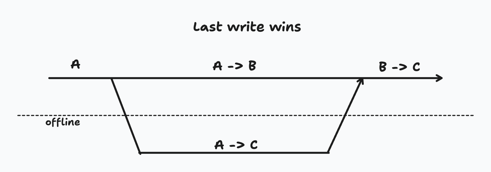
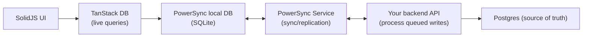
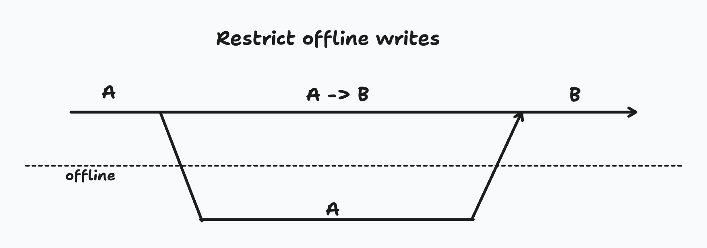
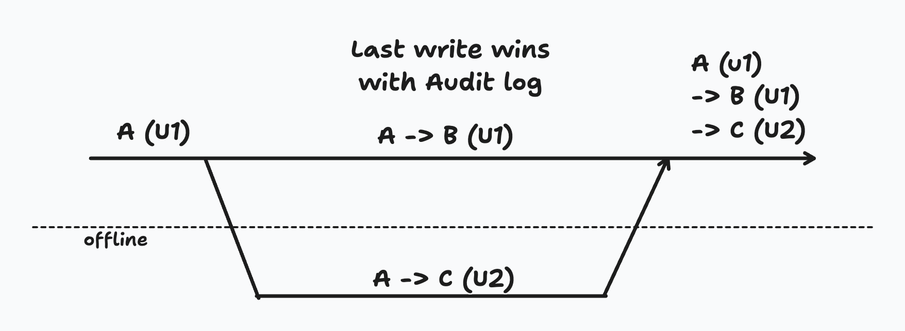
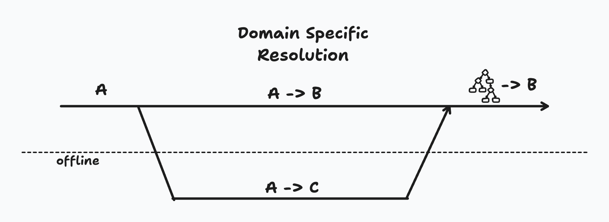
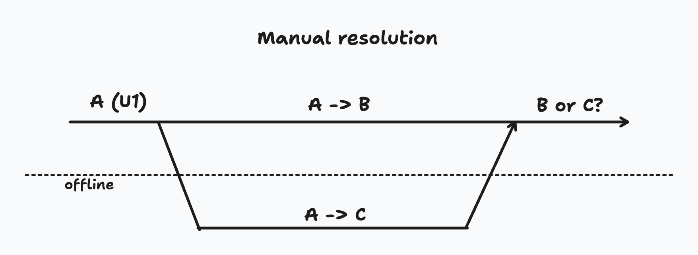
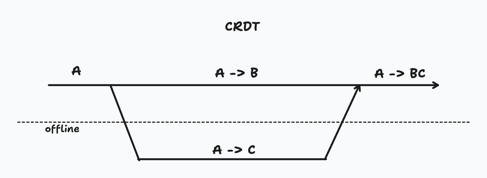

# Offline-First Apps with TanStack DB and PowerSync

Offline-first apps are web/native applications that keep working when the network is flaky or completely unavailable. The core promise is simple: users can always **read** their data instantly and consistently, and their **writes** are queued durably and sync when connectivity returns.

In practice, most of the complexity isn’t “offline storage” — it’s **conflicts**: deciding what should happen when multiple people (or devices) change the same data concurrently.

This post shows what building offline-first looks like with **PowerSync** and **TanStack DB**, and how to design conflict behavior that’s predictable for both users and operators.

## The Hassle of Offline

Building applications that can work offline is hard for a few reasons:

1. Traditional approaches (REST, GraphQL, etc.) only provide a way to access data over the network.
2. Web storage APIs are very low-level and difficult to use for non-trivial tasks.
3. Keeping a consistent local cache in sync with the server is a distributed systems problem.
4. Client state logic starts duplicating backend logic and gets complicated and inefficient.
5. Changes made offline can result in conflicts with server data, requiring resolution.

Sync engines solve (1)–(4) relatively well by providing:

1. Data access against a local database (often in-memory + persisted).
2. Automatic durable storage (filesystem / IndexedDB / SQLite).
3. Consistent bidirectional synchronization (server → client streaming, client → server queued writes).
4. Reactive queries for expressive state management (SQL or similar, type-safe builders).

The part that still requires product + engineering decisions is (5): **what to do when two valid writes disagree**.

## Theoretical vs Practical (What “Conflict” Really Means)

When two nodes are disconnected, you can’t assume there’s a single “true” timeline of intent. Clocks drift, messages arrive late, and “who wrote last” is often the wrong question.

That doesn’t mean offline writes are impossible — it means you must choose and implement **semantics**:

- Which fields are safe to edit offline?
- Which operations are allowed at all?
- When do we merge automatically vs ask a human?
- How do we make outcomes observable and auditable?

### A Concrete Conflict Scenario

Imagine a record’s data value starts as `A`.

- User 1 goes offline and changes the value to `C`.
- User 2 (online) changes the value to `B`.
- User 1 reconnects later and uploads their queued write.

If the backend blindly applies queued writes “as they arrive”, the final data value might become `C`, silently losing User 2’s newer update.

So the real question becomes: _what outcome does the business want here?_ That answer varies by field and workflow.



## The Stack: TanStack DB + PowerSync (Who Does What)

In this demo app (an offline festival ops board), the responsibilities are split cleanly:

- **PowerSync**
  - Owns the local database schema and storage (SQLite in the browser / device).
  - Replicates server → client so reads work offline.
  - Maintains a durable CRUD queue for client → server writes.
  - Calls your `uploadData` hook to push queued operations to your backend.
- **TanStack DB**
  - Provides _reactive collections_ over the local PowerSync-backed tables.
  - Powers live queries in the UI (SolidJS) without re-implementing caching logic.

Here’s the architecture at a glance:



### What the “wiring” looks like (real demo code)

PowerSync defines the local schema and the connector that uploads queued operations:

The code still uses `work-order` naming in identifiers and paths; the Festival Ops mapping is conceptual and 1:1.

```ts
// src/lib/powersync.client.ts (demo)
// In Festival Ops terms, this connector syncs queued festival task changes.
class WorkOrderConnector {
  async uploadData(database: AbstractPowerSyncDatabase) {
    while (true) {
      const tx = await database.getNextCrudTransaction();
      if (!tx) break;

      const payload = tx.crud.map((op) => ({
        op: op.op,
        table: op.table,
        id: op.id,
        opData: op.opData ?? {},
      }));

      const response = await uploadToServer(payload);
      if (!response.success)
        throw new Error(response.error ?? "write_batch_failed");
      await tx.complete();
    }
  }
}
```

TanStack DB wraps the PowerSync tables as reactive collections for the UI:

```ts
// src/lib/tanstack-db.ts (demo)
// `workOrdersCollection` is the backing collection for festival tasks in this demo.
export const workOrdersCollection = createCollection(
  powerSyncCollectionOptions({
    id: "work-orders",
    database: powerSyncDb,
    table: workOrderSchema.props.work_order,
    schema: workOrderZodSchema,
  }),
);
```

## Demo: A Festival Ops Board with Multiple Conflict Strategies

The demo intentionally uses **different strategies per data type**, because “one strategy for everything” is where offline UX tends to break down.

> (Screenshot) Festival task list + detail editor

### A decision matrix (rule of thumb)

| Data / operation                           | Typical requirement            | Recommended strategy              | Demo outcome              |
| ------------------------------------------ | ------------------------------ | --------------------------------- | ------------------------- |
| Festival task `title`, `urgency`           | Fast edits, low risk           | Last-write-wins                   | `applied`                 |
| Crew handoff `note` / collaborative text   | Preserve both users’ intent    | CRDT/OT (or merge)                | `merged`                  |
| Battery/cable stock counters               | Never go below zero            | Domain rules (reject invalid ops) | `applied` / `rejected`    |
| Task state transitions / delete            | Enforce workflow/permissions   | Restrict + validate server-side   | `rejected` (when invalid) |
| Sensitive contacts (artist/vendor hotline) | Must not silently lose updates | Manual review + resolution UI     | `needs_review`            |

## The Default Offline Write Path (and Why It’s Not Enough)

At the simplest level, offline writes flow like this:

1. Client makes changes while offline → PowerSync queues CRUD ops durably.
2. Client reconnects → PowerSync calls `uploadData`.
3. Backend processes operations in order and returns results.

That “process in order received” approach is a sane baseline, but it encodes a policy: **arrival order is treated as truth**. For many fields it’s fine — for others it’s wrong.

Two implementation details in the demo are worth calling out:

### 1) Idempotency / deduping

Offline clients retry. Tabs reload. Connections flap. You want “at least once” delivery to be safe.

The demo computes an `opKey` hash per operation and stores it in a `sync_operation` table so replays return the original result instead of applying twice:

```ts
// src/slices/sync-engine/reaction.process-write-batch.server.ts (demo)
// The op key makes retries idempotent across reconnects/replays.
function toOpKey(op, session) {
  const payload = JSON.stringify({
    op: op.op,
    table: op.table,
    id: op.id,
    opData: op.opData ?? {},
    userId: session.userId,
    role: session.role,
  });
  return createHash("sha1").update(payload).digest("hex");
}
```

### 2) Observability

Every operation returns a result code (e.g. `applied`, `merged`, `rejected`, `needs_review`) so the UI can show an activity timeline instead of leaving users guessing.

> (Screenshot) Sync activity timeline + Conflict Inbox

## Designing for Conflicts (Strategies That Scale)

### 1) Disable destructive actions (selectively)

The easiest way to avoid bad conflicts is to not allow the riskiest operations offline (or at all for some roles).

In the demo, delete and certain task state transitions are restricted server-side:



```ts
// src/slices/work-order/mutation.server.ts (demo)
// Role/permission checks gate risky task-state transitions and deletes.
if (op.op === UpdateType.DELETE && session.role !== "manager") {
  return { result: "rejected", reasonCode: "restricted_delete", ... };
}
```

This trades off capability for simplicity, but keeps the app usable offline for “safe” crew actions.

### 2) Audit / activity log

Sometimes last-write-wins is acceptable _if_ the history is visible and you can explain what happened.



Even a lightweight “operation results” log (like the demo’s `sync_operation` + UI timeline) dramatically reduces support/debug time when something surprises a user.

### 3) Domain-specific resolution

Some conflicts aren’t “two edits” — they’re business invariants.

In the demo, `part_usage_event` is modeled as an **append-only domain event** with an inventory check. Think of it as gear consumption events for batteries and cables. If applying an offline event would make inventory negative, it is rejected:



```ts
// src/slices/part-usage-event/mutation.server.ts (demo)
// Same pattern applies to festival gear consumption invariants.
if (onHand + qtyDelta < 0) {
  return { result: "rejected", reasonCode: "inventory_underflow", ... };
}
```

This is predictable, testable, and matches what crews often expect (“you can’t use gear you don’t have”).

### 4) Manual resolution (conflict inbox)

For sensitive fields like artist contacts or vendor hotlines, the safest move is to record a conflict and let a human decide.

In the demo, contact updates can create a `conflict_record` instead of silently overwriting. A Festival Lead can then pick “keep local”, “keep server”, or enter a custom value:



```ts
// src/slices/conflict-record/mutation.server.ts (demo)
// Manual resolver: keep local, keep server, or choose a custom value.
if (strategy === "local") value = conflict.local_value?.value ?? null;
if (strategy === "server") value = conflict.server_value?.value ?? null;
if (strategy === "custom") value = customValue ?? null;
```

### 5) CRDT / OT for collaborative text

For collaborative documents, “pick a winner” is usually the wrong UX. CRDTs and OT are designed to merge concurrent edits.



The demo uses a deliberately simple merge for `work_order_note.crdt_payload` (line-based uniqueness) to illustrate the shape of the solution. In production, you’d typically reach for something like Yjs or Automerge depending on your requirements and architecture.

## Optionality: Start Simple, Upgrade by Data Type

Very few apps need every strategy everywhere. A pragmatic path that works well:

1. Start with last-write-wins for low-risk fields.
2. Add domain checks for invariant-heavy workflows.
3. Add manual review where silent overwrites are unacceptable.
4. Use CRDT/OT only where users genuinely expect multi-writer collaboration.

The key is to treat conflict behavior as **part of your product design**, not a backend implementation detail.

## Try the Demo (CTA)

If you want to see these strategies side-by-side, run the demo in this repo:

```bash
bun install
cp .env.example .env
bun run dev:stack:up
bun dev
```

Then:

1. Switch to Stage Tech, go offline, edit festival tasks, add a crew note, and record gear usage events.
2. Reconnect and observe which ops are `applied`, `merged`, `rejected`, or `needs_review`.
3. Switch to Festival Lead and resolve artist/vendor contact conflicts in the Conflict Inbox.

## References

- [PowerSync docs: Handling update conflicts](https://docs.powersync.com/handling-writes/handling-update-conflicts)
- [PowerSync docs: Custom conflict resolution](https://docs.powersync.com/handling-writes/custom-conflict-resolution)
- [PowerSync blog: Offline-first apps made simple](https://www.powersync.com/blog/offline-first-apps-made-simple-supabase-powersync)
- [PowerSync blog: Local-first key concepts](https://www.powersync.com/blog/local-first-key-concepts-offline-first-vs-local-first)
- [Supabase blog: Postgres + CRDTs (offline philosophy)](https://supabase.com/blog/postgres-crdt#offline-philosophy)
